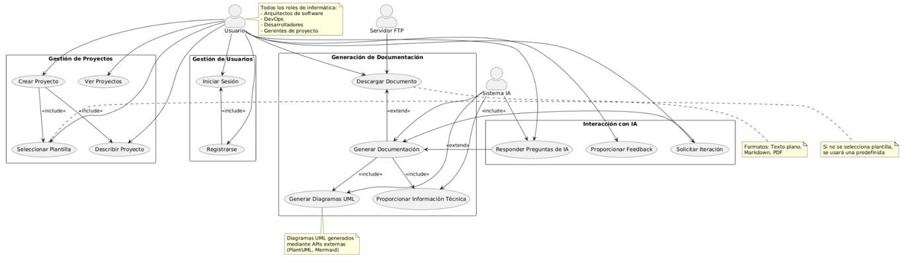
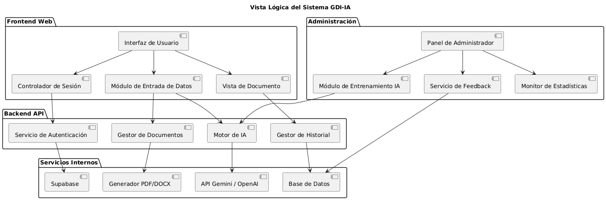
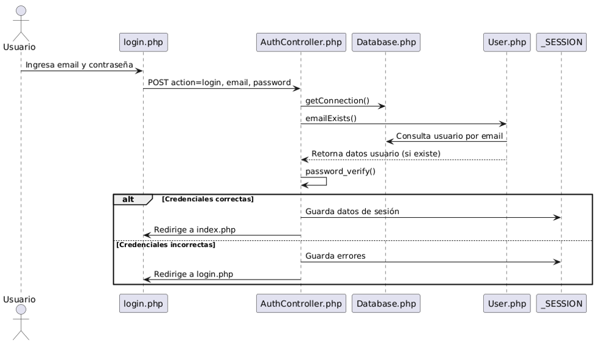
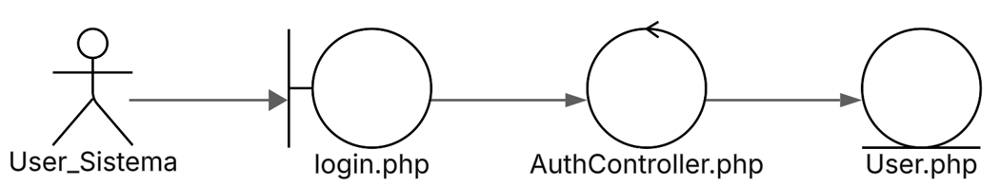
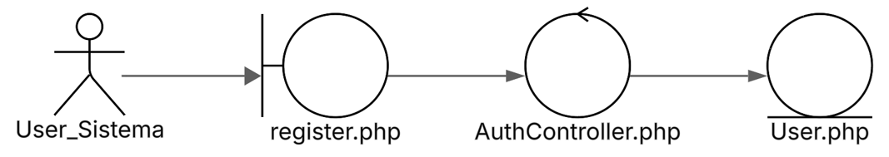
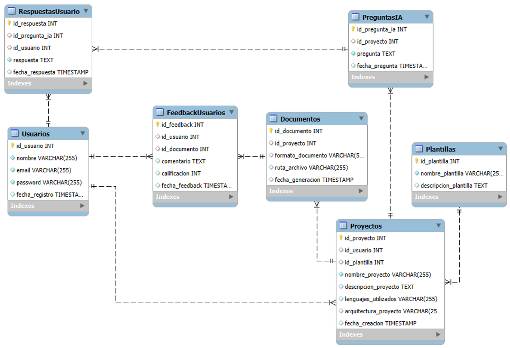
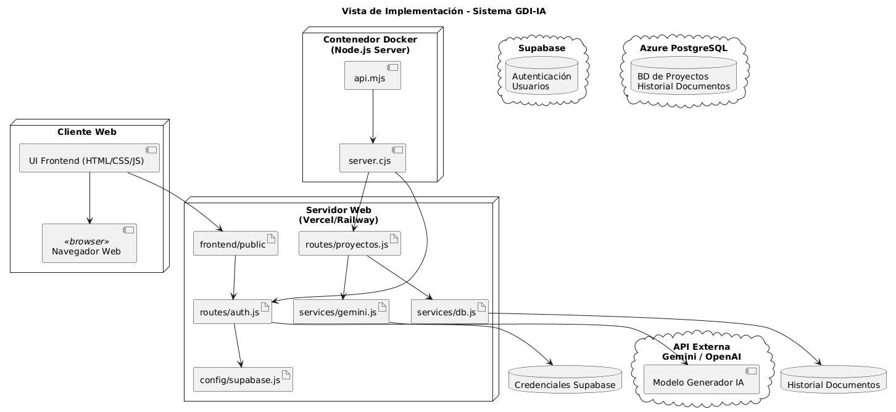
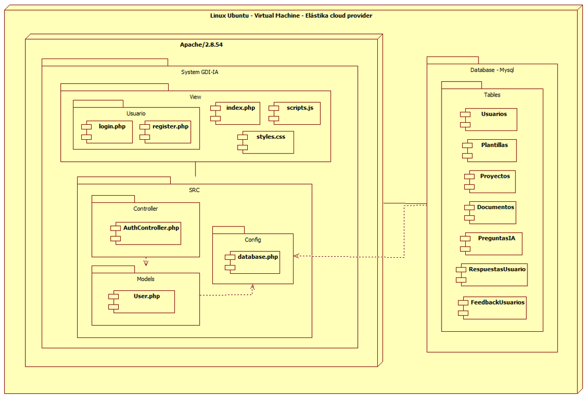

# UNIVERSIDAD PRIVADA DE TACNA

## FACULTAD DE INGENIERÍA

### Escuela Profesional de Ingeniería de Sistemas

## Proyecto

**“Generador de documentación impulsado por IA (GDI-IA)”**

**Documento de Arquitectura de Software**

**Curso:**  
*Calidad y Pruebas de Software*

**Docente:**  
*Mag. Patrick Cuadros Quiroga*

**Integrantes:**
- *Ancco Suaña, Bruno Enrique (2023077472)*
- *Akhtar Oviedo, Ahmed Hasan (2022074261)*
- *Ayala Ramos, Carlos Daniel (2022074266)*
- *Salas Jiménez, Walter Emmanuel (2022073896)*

**Tacna – Perú**  
**2025**

 

---

| **Versión** | **Hecha por**         | **Revisada por** | **Aprobada por** | **Fecha**   | **Motivo**      |
|:-----------:|:---------------------:|:----------------:|:----------------:|:-----------:|:---------------:|
| 1.0         | AHAO, CDAR, WESJ, BEAS| PCQ              | -                | 24/04/2025  | Versión 1.0     |

---

## Índice General

1. [Introducción](#introducción)
    1. [Propósito (Diagrama 4+1)](#propósito-diagrama-41)
    2. [Alcance](#alcance)
    3. [Definición, siglas y abreviaturas](#definición-siglas-y-abreviaturas)
    4. [Organización del documento](#organización-del-documento)
2. [Objetivos y Restricciones Arquitectónicas](#objetivos-y-restricciones-arquitectónicas)
    1. [Priorización de requerimientos](#priorización-de-requerimientos)
    2. [Requerimientos funcionales](#requerimientos-funcionales)
    3. [Requerimientos no funcionales - Atributos de calidad](#requerimientos-no-funcionales---atributos-de-calidad)
    4. [Restricciones](#restricciones)
3. [Representación de la Arquitectura del Sistema](#representación-de-la-arquitectura-del-sistema)
4. [Atributos de Calidad del Software](#atributos-de-calidad-del-software)

---

## Introducción

### Propósito (Diagrama 4+1)

Este documento presenta una visión estructurada de la arquitectura del sistema **Generador de Documentación Impulsado por IA (GDI-IA)**, abordando requerimientos funcionales y no funcionales desde una perspectiva de diseño basada en el modelo 4+1. El objetivo es asegurar eficiencia, escalabilidad y portabilidad, proporcionando una plataforma web que automatice la generación de documentación estructurada mediante servicios de inteligencia artificial.

### Alcance

El sistema abarca:
- Generación automatizada de documentos técnicos bajo formatos FD01–FD06.
- Captura de información a través de formularios interactivos.
- Integración de APIs para IA (redacción, generación de diagramas).
- Exportación a formatos PDF y DOCX.
- Almacenamiento en servidor FTP.
- Gestión de versiones y plantillas.

### Definición, siglas y abreviaturas

| Término   | Definición                                                           |
|-----------|----------------------------------------------------------------------|
| API       | Interfaz de Programación de Aplicaciones (Application Programming Interface) |
| DOCX      | Formato de documento de Microsoft Word                              |
| FD01-FD06 | Formatos documentales estandarizados para proyectos de software      |
| IA        | Inteligencia Artificial                                              |
| PDF       | Formato de Documento Portátil (Portable Document Format)             |

### Organización del documento

El informe detalla las vistas arquitectónicas del sistema: lógica, procesos, despliegue, casos de uso e implementación, seguidas de los atributos de calidad clave.

## Objetivos y Restricciones Arquitectónicas

### Priorización de requerimientos

A continuación, se listan los requerimientos priorizados:

#### Funcionales

| ID               | Descripción                                                                                      | Prioridad |
|------------------|--------------------------------------------------------------------------------------------------|-----------|
| RegistroUsuario  | Permitir la creación de cuentas de usuario                                                        | Alta      |
| RegistroAdmin    | Permitir la creación de cuentas de administrador                                                  | Alta      |
| ModuloInput      | Módulo para ingresar información clave según formato                                              | Alta      |
| SeleccionFormato | Seleccionar formato estandarizado para iniciar nuevo documento                                    | Alta      |
| MultiIdioma      | Generar documentos en distintos idiomas (si el modelo IA lo permite)                             | Alta      |
| ModelosIA        | Contener modelos de IA                                                                            | Alta      |
| GenerarPDF       | Generar documentos completos en PDF                                                               | Alta      |
| DescargaInmediata| Permitir la descarga inmediata del documento                                                      | Alta      |
| GenerarCitas     | Generar citas y bibliografía automáticamente según formato                                        | Alta      |
| HistorialDocs    | Almacenar historial de documentos realizados                                                      | Alta      |
| DescargaHistorial| Permitir descarga de documentos previos                                                           | Alta      |

#### No Funcionales (Atributos de Calidad)

| ID                             | Descripción                                                                    | Prioridad |
|--------------------------------|--------------------------------------------------------------------------------|-----------|
| Debe integrar Login            | Validar credenciales de usuario                                                | Alta      |
| Accesibilidad multiplataforma  | Acceso desde navegadores web modernos y dispositivos móviles                    | Alta      |
| Seguridad de la información    | Autenticación, cifrado y control de acceso                                     | Alta      |
| Escalabilidad                  | Preparado para escalar en usuarios y tipos de formatos                         | Alta      |
| Compatibilidad con estándares  | Cumplimiento de estándares y formatos institucionales                          | Alta      |
| Tolerancia a fallos            | Mensaje claro y reintento ante fallo de IA/servicios externos                   | Alta      |
| Registro de errores (log)      | Registro de errores internos para soporte y mejora                              | Alta      |
| Interfaz adaptativa (responsive)| Adaptación a distintos tamaños de pantalla                                     | Alta      |

### Restricciones

- El sistema debe ser accesible vía web desde computadoras o dispositivos móviles con conexión a internet.
- Dependencia de servicios externos de IA para la generación de contenido.
- El sistema no incluirá funcionalidades de edición manual posterior al documento generado.

## Representación de la Arquitectura del Sistema

### Vista de Caso de Uso
- **Usuario** interactúa con el sistema: inicia sesión, selecciona plantilla, proporciona datos y genera documentos.
- **Sistema** valida, consulta modelos IA y devuelve el documento generado.

### Vista de Caso de Uso

### Vista Logica

### Vista Subsistema (Paquetes)

### Vista Secuencia (Vista Diseño)

### Vista Objetos

#### a.	Ingreso al Sistema del Generador de documentación impulsado por IA

Describe gráficamente cómo el usuario interactúa con el sistema para acceder a la interfaz de inicio de sesión, donde ingresa sus credenciales. El sistema valida esta información a través del controlador(AuthController) y la clase de acceso a datos de login (User), permitiendo el ingreso al sistema

#### b.	Registro de Usuario dentro del Sistema

Describe gráficamente cómo el usuario interactúa con el sistema para registrase. El usuario accede a la interfaz de registro, la cual envía la información al controlador(AuthController), que a su vez gestiona la interacción con la clase de registro de usuarios(User).

### Diagrama de Clases

### Diagrama de Base de Datos

### Vista de Implementacion

### Vista de Arquitectura de Software

###	Diagrama de arquitectura del sistema (Diagrama de componentes)

## Atributos de Calidad del Software

### Escenario de Funcionalidad

El sistema cumple funciones de generación documental con IA, exportación, almacenamiento y gestión.

### Escenario de Usabilidad

Interfaz intuitiva accesible desde navegador moderno en móviles y PCs. Bajo tiempo de aprendizaje.

### Escenario de confiabilidad

Seguridad en acceso y encriptación de datos. Logs de errores y recuperación ante fallos.

### Escenario de rendimiento

Generación de documentos en tiempo real. Tiempos de respuesta óptimos gracias a ejecución asincrónica.

### Escenario de mantenibilidad

Arquitectura modular y documentación clara de componentes.

### Otros Escenarios

- **Performance:** Alta capacidad de respuesta bajo carga moderada.
- **Escalabilidad:** Listo para crecer horizontalmente en la nube.