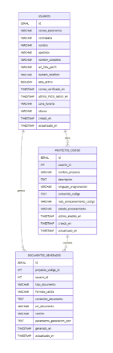

**"Año de la recuperación y consolidación de la economía peruana"**

**UNIVERSIDAD PRIVADA DE TACNA**

**FACULTAD DE INGENIERÍA**\

**Escuela Profesional de Ingeniería de Sistemas**

` `**“Generador de documentación impulsado por IA (GDI-IA)”**\

Curso: *Calidad y Pruebas de Software*\

Docente: *Mag. Patrick Cuadros Quiroga*

Integrantes:

***Akhtar Oviedo, Ahmed Hasan 		(2022074261)***

***Ayala Ramos, Carlos Daniel 		(2022074266)***

***Salas Jiménez, Walter Emmanuel 	(2022073896)***

***Ancco Suaña, Bruno Enrique 		(2023077472)***

**Tacna – Perú**\

***2025***

**Generador de documentación impulsado por IA (GDI-IA)**

**Diccionario de Datos**

**Versión *1.0***

# ÍNDICE GENERAL

[**ÍNDICE GENERAL	3**](#_heading=h.sx5w9s76a6ts)

[**1. Modelo Entidad / Relación	4**](#_heading=h.b50s83banry8)

[1.1 Diseño lógico	4](#_heading=h.bmy3n7uzlhyq)

[1.2 Diseño Físico	4](#_heading=h.7802h7fbii7)

[2. Diccionario de Datos	5](#_heading=h.mqpmjjeh1mb5)

[2.1 Tablas	5](#_heading=h.c9wt7qtrq2th)

[2.2 Lenguaje de Definición de Datos (DDL)	9](#_heading=h.2705emr9bx02)

[Creación de Tablas	9](#_heading=h.fdgbqkkarytp)

[2.4 Lenguaje de Manipulación de Datos (DML)	11](#_heading=h.g9e3stpqynnu)

[2.5 Índices	11](#_heading=h.n75exud9ova8)

**Diccionario de Datos**
# 1. Modelo Entidad / Relación
## **1.1 Diseño lógico**
## **1.2 Diseño Físico	![ref1]![ref2]![ref3]**
## **
# 2. Diccionario de Datos
## **2.1 Tablas**

<table><tr><th colspan="3" valign="bottom"><b>Nombre de la Tabla:</b></th><th colspan="4" valign="bottom">usuarios</th></tr>
<tr><td colspan="3" valign="bottom"><b>Descripción de la Tabla:</b></td><td colspan="4" valign="bottom">Almacena la información de los usuarios del sistema, incluyendo sus credenciales, información personal, configuración de idioma y zona horaria.</td></tr>
<tr><td colspan="3" valign="bottom"><b>Objetivo:</b></td><td colspan="4" valign="bottom">Gestionar la información de autenticación y perfil de los usuarios para permitir el acceso y la personalización del sistema.</td></tr>
<tr><td colspan="3" valign="bottom"><b>Relaciones con otras Tablas:</b></td><td colspan="4" valign="bottom">
 proyectos_codigo (uno a muchos)

documentos_generados (uno a muchos)
</td></tr>
<tr><td colspan="7" valign="bottom"><b>Descripción de los campos</b></td></tr>
<tr><td rowspan="2" valign="bottom"><b>N°</b></td><td rowspan="2" valign="bottom"><b>Nombre del campo</b></td><td rowspan="2" valign="bottom"><b>Tipo dato longitud</b></td><td rowspan="2" valign="bottom"><b>Permite nulos</b></td><td rowspan="2" valign="bottom"><b>Clave primaria</b></td><td rowspan="2" valign="bottom"><b>Clave foránea</b></td><td rowspan="2" valign="bottom"><b>Descripción del campo</b></td></tr>
<tr></tr>
<tr><td valign="bottom">1</td><td valign="bottom">id</td><td valign="bottom">SERIAL</td><td valign="bottom">NO</td><td valign="bottom">SI</td><td valign="bottom">NO</td><td valign="bottom">Identificador único del usuario.</td></tr>
<tr><td valign="bottom">2</td><td valign="bottom">contrasena</td><td valign="bottom">VARCHAR(255)</td><td valign="bottom">NO</td><td valign="bottom">NO</td><td valign="bottom">NO</td><td valign="bottom">Contraseña encriptada del usuario.</td></tr>
<tr><td valign="bottom">3</td><td valign="bottom">nombre</td><td valign="bottom">VARCHAR(100)</td><td valign="bottom">SÍ</td><td valign="bottom">NO</td><td valign="bottom">NO</td><td valign="bottom">Nombre del usuario.</td></tr>
<tr><td valign="bottom">4</td><td valign="bottom">apellidos</td><td valign="bottom">VARCHAR(100)</td><td valign="bottom">SÍ</td><td valign="bottom">NO</td><td valign="bottom">NO</td><td valign="bottom">Apellidos del usuario.</td></tr>
<tr><td valign="bottom">5</td><td valign="bottom">nombre_completo</td><td valign="bottom">VARCHAR(200) (GENERATED)</td><td valign="bottom">NO</td><td valign="bottom">NO</td><td valign="bottom">NO</td><td valign="bottom">Campo generado automáticamente que concatena nombre y apellidos.</td></tr>
<tr><td valign="bottom">6</td><td valign="bottom">url_foto_perfil</td><td valign="bottom">VARCHAR(2048)</td><td valign="bottom">SÍ</td><td valign="bottom">NO</td><td valign="bottom">NO</td><td valign="bottom">URL de la foto de perfil del usuario.</td></tr>
<tr><td valign="bottom">7</td><td valign="bottom">numero_telefono</td><td valign="bottom">VARCHAR(50)</td><td valign="bottom">SÍ</td><td valign="bottom">NO</td><td valign="bottom">NO</td><td valign="bottom">Número de teléfono del usuario.</td></tr>
<tr><td valign="bottom">8</td><td valign="bottom">esta_activo</td><td valign="bottom">BOOLEAN</td><td valign="bottom">SÍ (DEFAULT)</td><td valign="bottom">NO</td><td valign="bottom">NO</td><td valign="bottom">Indica si el usuario está activo.</td></tr>
<tr><td valign="bottom">9</td><td valign="bottom">correo_verificado_en</td><td valign="bottom">TIMESTAMP</td><td valign="bottom">SÍ</td><td valign="bottom">NO</td><td valign="bottom">NO</td><td valign="bottom">Fecha y hora en la que el correo fue verificado.</td></tr>
<tr><td valign="bottom">10</td><td valign="bottom">ultimo_inicio_sesion_en</td><td valign="bottom">TIMESTAMP</td><td valign="bottom">SÍ</td><td valign="bottom">NO</td><td valign="bottom">NO</td><td valign="bottom">Fecha y hora del último inicio de sesión.</td></tr>
<tr><td valign="bottom">11</td><td valign="bottom">zona_horaria</td><td valign="bottom">VARCHAR(100)</td><td valign="bottom">SÍ (DEFAULT)</td><td valign="bottom">NO</td><td valign="bottom">NO</td><td valign="bottom">Zona horaria del usuario.</td></tr>
<tr><td valign="bottom">12</td><td valign="bottom">idioma</td><td valign="bottom">VARCHAR(10)</td><td valign="bottom">SÍ (DEFAULT)</td><td valign="bottom">NO</td><td valign="bottom">NO</td><td valign="bottom">Idioma preferido del usuario.</td></tr>
<tr><td valign="bottom">13</td><td valign="bottom">creado_en</td><td valign="bottom">TIMESTAMP</td><td valign="bottom">NO (DEFAULT)</td><td valign="bottom">NO</td><td valign="bottom">NO</td><td valign="bottom">Fecha y hora de creación del registro.</td></tr>
<tr><td valign="bottom">14</td><td valign="bottom">actualizado_en</td><td valign="bottom">TIMESTAMP</td><td valign="bottom">NO (DEFAULT)</td><td valign="bottom">NO</td><td valign="bottom">NO</td><td valign="bottom">Fecha y hora de última actualización.</td></tr>
<tr><td valign="bottom">15</td><td valign="bottom">contrasena</td><td valign="bottom">VARCHAR(255)</td><td valign="bottom">NO</td><td valign="bottom">NO</td><td valign="bottom">NO</td><td valign="bottom">Contraseña encriptada del usuario.</td></tr>
</table>

<table><tr><th colspan="3" valign="bottom"><b>Nombre de la Tabla:</b></th><th colspan="4" valign="bottom">proyectos_codigo</th></tr>
<tr><td colspan="3" valign="bottom"><b>Descripción de la Tabla:</b></td><td colspan="4" valign="bottom">Almacena los proyectos de código subidos por los usuarios, incluyendo información sobre su contenido, estado de procesamiento y metadatos.</td></tr>
<tr><td colspan="3" valign="bottom"><b>Objetivo:</b></td><td colspan="4" valign="bottom">
Gestionar los proyectos de programación de los usuarios para su análisis, almacenamiento y visualización.

</td></tr>
<tr><td colspan="3" valign="bottom"><b>Relaciones con otras Tablas:</b></td><td colspan="4" valign="bottom">
usuarios (muchos a uno)

documentos_generados (uno a muchos)
</td></tr>
<tr><td colspan="7" valign="bottom"><b>Descripción de los campos</b></td></tr>
<tr><td rowspan="2" valign="bottom"><b>N°</b></td><td rowspan="2" valign="bottom"><b>Nombre del campo</b></td><td rowspan="2" valign="bottom"><b>Tipo dato longitud</b></td><td rowspan="2" valign="bottom"><b>Permite nulos</b></td><td rowspan="2" valign="bottom"><b>Clave primaria</b></td><td rowspan="2" valign="bottom"><b>Clave foránea</b></td><td rowspan="2" valign="bottom"><b>Descripción del campo</b></td></tr>
<tr></tr>
<tr><td valign="bottom">1</td><td valign="bottom">id</td><td valign="bottom">SERIAL</td><td valign="bottom">NO</td><td valign="bottom">SÍ</td><td valign="bottom">NO</td><td valign="bottom">Identificador único del proyecto.</td></tr>
<tr><td valign="bottom">2</td><td valign="bottom">usuario_id</td><td valign="bottom">INT</td><td valign="bottom">NO</td><td valign="bottom">NO</td><td valign="bottom">SÍ</td><td valign="bottom">Identificador del usuario propietario del proyecto.</td></tr>
<tr><td valign="bottom">3</td><td valign="bottom">nombre_proyecto</td><td valign="bottom">VARCHAR(255)</td><td valign="bottom">NO</td><td valign="bottom">NO</td><td valign="bottom">NO</td><td valign="bottom">Nombre del proyecto de código.</td></tr>
<tr><td valign="bottom">4</td><td valign="bottom">descripcion</td><td valign="bottom">TEXT</td><td valign="bottom">SÍ</td><td valign="bottom">NO</td><td valign="bottom">NO</td><td valign="bottom">Descripción opcional del proyecto.</td></tr>
<tr><td valign="bottom">5</td><td valign="bottom">lenguaje_programacion</td><td valign="bottom">VARCHAR(50)</td><td valign="bottom">SÍ</td><td valign="bottom">NO</td><td valign="bottom">NO</td><td valign="bottom">Lenguaje de programación utilizado.</td></tr>
<tr><td valign="bottom">6</td><td valign="bottom">contenido_codigo</td><td valign="bottom">TEXT</td><td valign="bottom">SÍ</td><td valign="bottom">NO</td><td valign="bottom">NO</td><td valign="bottom">Contenido del código fuente del proyecto.</td></tr>
<tr><td valign="bottom">7</td><td valign="bottom">ruta_almacenamiento_codigo</td><td valign="bottom">VARCHAR(2048)</td><td valign="bottom">SÍ</td><td valign="bottom">NO</td><td valign="bottom">NO</td><td valign="bottom">Ruta donde se almacena el código.</td></tr>
<tr><td valign="bottom">8</td><td valign="bottom">estado_procesamiento</td><td valign="bottom">VARCHAR(20)</td><td valign="bottom">SÍ (DEFAULT)</td><td valign="bottom">NO</td><td valign="bottom">NO</td><td valign="bottom">Estado del procesamiento del proyecto.</td></tr>
<tr><td valign="bottom">9</td><td valign="bottom">ultimo_analisis_en</td><td valign="bottom">TIMESTAMP</td><td valign="bottom">SÍ</td><td valign="bottom">NO</td><td valign="bottom">NO</td><td valign="bottom">Fecha del último análisis realizado.</td></tr>
<tr><td valign="bottom">10</td><td valign="bottom">creado_en</td><td valign="bottom">TIMESTAMP</td><td valign="bottom">NO (DEFAULT)</td><td valign="bottom">NO</td><td valign="bottom">NO</td><td valign="bottom">Fecha y hora de creación del registro.</td></tr>
<tr><td valign="bottom">11</td><td valign="bottom">actualizado_en</td><td valign="bottom">TIMESTAMP</td><td valign="bottom">NO (DEFAULT)</td><td valign="bottom">NO</td><td valign="bottom">NO</td><td valign="bottom">Fecha y hora de la última actualización.</td></tr>
</table>

<table><tr><th colspan="3" valign="bottom"><b>Nombre de la Tabla:</b></th><th colspan="4" valign="bottom">documentos_generados</th></tr>
<tr><td colspan="3" valign="bottom"><b>Descripción de la Tabla:</b></td><td colspan="4" valign="bottom">Almacena documentos generados automáticamente a partir de proyectos de código, en distintos formatos y versione</td></tr>
<tr><td colspan="3" valign="bottom"><b>Objetivo:</b></td><td colspan="4" valign="bottom">
Permitir a los usuarios visualizar, descargar o compartir documentación generada automáticamente desde sus proyectos de código.

</td></tr>
<tr><td colspan="3" valign="bottom"><b>Relaciones con otras Tablas:</b></td><td colspan="4" valign="bottom">
usuarios (muchos a uno)

documentos_generados (uno a muchos)
</td></tr>
<tr><td colspan="7" valign="bottom"><b>Descripción de los campos</b></td></tr>
<tr><td rowspan="2" valign="bottom"><b>N°</b></td><td rowspan="2" valign="bottom"><b>Nombre del campo</b></td><td rowspan="2" valign="bottom"><b>Tipo dato longitud</b></td><td rowspan="2" valign="bottom"><b>Permite nulos</b></td><td rowspan="2" valign="bottom"><b>Clave primaria</b></td><td rowspan="2" valign="bottom"><b>Clave foránea</b></td><td rowspan="2" valign="bottom"><b>Descripción del campo</b></td></tr>
<tr></tr>
<tr><td valign="bottom">1</td><td valign="bottom">id</td><td valign="bottom">SERIAL</td><td valign="bottom">NO</td><td valign="bottom">SÍ</td><td valign="bottom">NO</td><td valign="bottom">Identificador único del documento generado.</td></tr>
<tr><td valign="bottom">2</td><td valign="bottom">proyecto_codigo_id</td><td valign="bottom">INT</td><td valign="bottom">NO</td><td valign="bottom">NO</td><td valign="bottom">SÍ</td><td valign="bottom">Identificador del proyecto del que proviene el documento.</td></tr>
<tr><td valign="bottom">3</td><td valign="bottom">usuario_id</td><td valign="bottom">INT</td><td valign="bottom">NO</td><td valign="bottom">NO</td><td valign="bottom">SÍ</td><td valign="bottom">Identificador del usuario que generó el documento.</td></tr>
<tr><td valign="bottom">4</td><td valign="bottom">tipo_documento</td><td valign="bottom">VARCHAR(100)</td><td valign="bottom">NO</td><td valign="bottom">NO</td><td valign="bottom">NO</td><td valign="bottom">Tipo de documento generado.</td></tr>
<tr><td valign="bottom">5</td><td valign="bottom">formato_salida</td><td valign="bottom">VARCHAR(20)</td><td valign="bottom">SÍ (DEFAULT)</td><td valign="bottom">NO</td><td valign="bottom">NO</td><td valign="bottom">Formato del documento generado.</td></tr>
<tr><td valign="bottom">6</td><td valign="bottom">contenido_documento</td><td valign="bottom">TEXT</td><td valign="bottom">SÍ</td><td valign="bottom">NO</td><td valign="bottom">NO</td><td valign="bottom">Contenido completo del documento generado.</td></tr>
<tr><td valign="bottom">7</td><td valign="bottom">url_documento</td><td valign="bottom">VARCHAR(2048)</td><td valign="bottom">SÍ</td><td valign="bottom">NO</td><td valign="bottom">NO</td><td valign="bottom">URL de acceso o descarga del documento.</td></tr>
<tr><td valign="bottom">8</td><td valign="bottom">version</td><td valign="bottom">VARCHAR(20)</td><td valign="bottom">SÍ (DEFAULT)</td><td valign="bottom">NO</td><td valign="bottom">NO</td><td valign="bottom">Versión del documento generado.</td></tr>
<tr><td valign="bottom">9</td><td valign="bottom">parametros_generacion_json</td><td valign="bottom">TEXT</td><td valign="bottom">SÍ</td><td valign="bottom">NO</td><td valign="bottom">NO</td><td valign="bottom">Parámetros en formato JSON usados para generar el documento.</td></tr>
<tr><td valign="bottom">10</td><td valign="bottom">generado_en</td><td valign="bottom">TIMESTAMP</td><td valign="bottom">NO (DEFAULT)</td><td valign="bottom">NO</td><td valign="bottom">NO</td><td valign="bottom">Fecha y hora en que fue generado el documento.</td></tr>
<tr><td valign="bottom">11</td><td valign="bottom">actualizado_en</td><td valign="bottom">TIMESTAMP</td><td valign="bottom">NO (DEFAULT)</td><td valign="bottom">NO</td><td valign="bottom">NO</td><td valign="bottom">Fecha y hora de la última actualización.</td></tr>
</table>

## **2.2 Lenguaje de Definición de Datos (DDL)**
Creación de Base de Datos

**CREATE DATABASE docugen;**

**GO**
## **Creación de Tablas**
`	`**USE docugen;**\

`	`**-- Tabla usuarios**\

**CREATE TABLE usuarios (**

`    `**id SERIAL PRIMARY KEY,**

`    `**correo\_electronico VARCHAR(255) NOT NULL,**

`    `**contrasena VARCHAR(255) NOT NULL,**

`    `**nombre VARCHAR(100),**

`    `**apellidos VARCHAR(100),**

`    `**nombre\_completo VARCHAR(200) GENERATED ALWAYS AS (concat\_ws(' ', nombre, apellidos)) STORED,**

`    `**url\_foto\_perfil VARCHAR(2048),**

`    `**numero\_telefono VARCHAR(50),**

`    `**esta\_activo BOOLEAN DEFAULT TRUE,**

`    `**correo\_verificado\_en TIMESTAMP NULL,**

`    `**ultimo\_inicio\_sesion\_en TIMESTAMP NULL,**

`    `**zona\_horaria VARCHAR(100) DEFAULT 'UTC',**

`    `**idioma VARCHAR(10) DEFAULT 'es',**

`    `**creado\_en TIMESTAMP DEFAULT CURRENT\_TIMESTAMP,**

`    `**actualizado\_en TIMESTAMP DEFAULT CURRENT\_TIMESTAMP**

**);**

**-- Tabla proyectos\_codigo**

**CREATE TABLE proyectos\_codigo (**

`    `**id SERIAL PRIMARY KEY,**

`    `**usuario\_id INT NOT NULL,**

`    `**nombre\_proyecto VARCHAR(255) NOT NULL,**

`    `**descripcion TEXT,**

`    `**lenguaje\_programacion VARCHAR(50),**

`    `**contenido\_codigo TEXT,**

`    `**ruta\_almacenamiento\_codigo VARCHAR(2048),**

`    `**estado\_procesamiento VARCHAR(20) DEFAULT 'pendiente' CHECK (**

`        `**estado\_procesamiento IN (**

`            `**'pendiente', 'subiendo', 'procesando',**

`            `**'completado', 'error\_subida', 'error\_analisis'**

`        `**)**

`    `**),**

`    `**ultimo\_analisis\_en TIMESTAMP NULL,**

`    `**creado\_en TIMESTAMP DEFAULT CURRENT\_TIMESTAMP,**

`    `**actualizado\_en TIMESTAMP DEFAULT CURRENT\_TIMESTAMP,**

`    `**CONSTRAINT fk\_proyecto\_usuario FOREIGN KEY (usuario\_id)**

`        `**REFERENCES usuarios(id) ON DELETE CASCADE**

**);**

**-- Tabla documentos\_generados**

**CREATE TABLE documentos\_generados (**

`    `**id SERIAL PRIMARY KEY,**

`    `**proyecto\_codigo\_id INT NOT NULL,**

`    `**usuario\_id INT NOT NULL,**

`    `**tipo\_documento VARCHAR(100) NOT NULL,**

`    `**formato\_salida VARCHAR(20) DEFAULT 'texto\_plano' CHECK (**

`        `**formato\_salida IN ('texto\_plano', 'markdown', 'pdf\_url', 'json')**

`    `**),**

`    `**contenido\_documento TEXT,**

`    `**url\_documento VARCHAR(2048),**

`    `**version VARCHAR(20) DEFAULT '1.0',**

`    `**parametros\_generacion\_json TEXT,**

`    `**generado\_en TIMESTAMP DEFAULT CURRENT\_TIMESTAMP,**

`    `**actualizado\_en TIMESTAMP DEFAULT CURRENT\_TIMESTAMP,**

`    `**CONSTRAINT fk\_documento\_proyecto FOREIGN KEY (proyecto\_codigo\_id)**

`        `**REFERENCES proyectos\_codigo(id) ON DELETE CASCADE,**

`    `**CONSTRAINT fk\_documento\_usuario FOREIGN KEY (usuario\_id)**

`        `**REFERENCES usuarios(id) ON DELETE CASCADE**

**);**
**2.4 Lenguaje de Manipulación de Datos (DML)**\

-------------------------------------------------------------------------------------
**SELECT \* FROM usuarios**

**SELECT \* FROM proyectos\_codigo**

**SELECT \* FROM documentos\_generados**
**2.5 Índices**\

-----------------------------------------------------
**CREATE INDEX idx\_usuario\_correo ON usuarios (correo\_electronico);**

**CREATE INDEX idx\_proyecto\_usuario ON proyectos\_codigo (usuario\_id);**

[ref1]: Aspose.Words.371a4645-4a4d-4069-82a8-de015372e062.003.png
[ref2]: Aspose.Words.371a4645-4a4d-4069-82a8-de015372e062.004.png
[ref3]: Aspose.Words.371a4645-4a4d-4069-82a8-de015372e062.005.png
