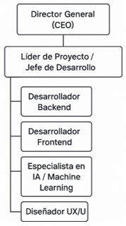
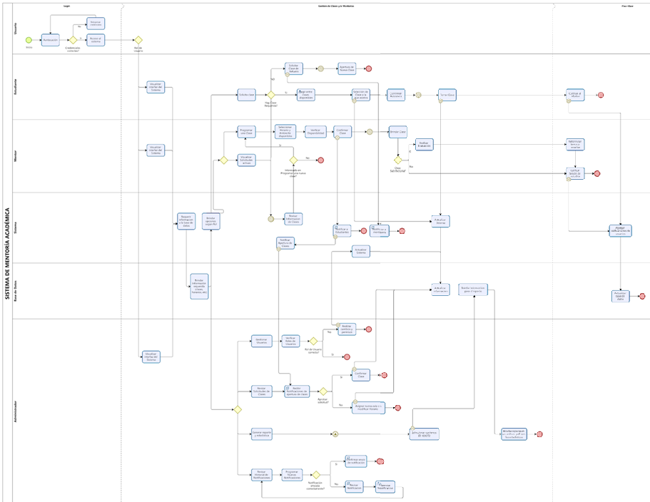
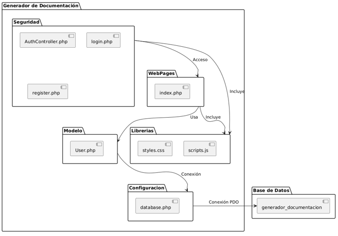
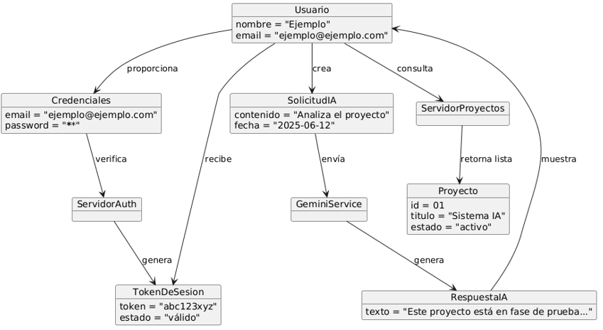
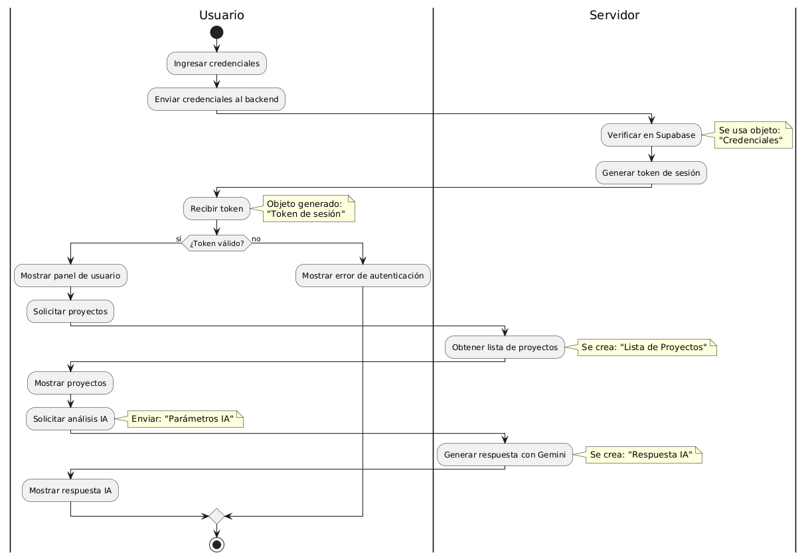
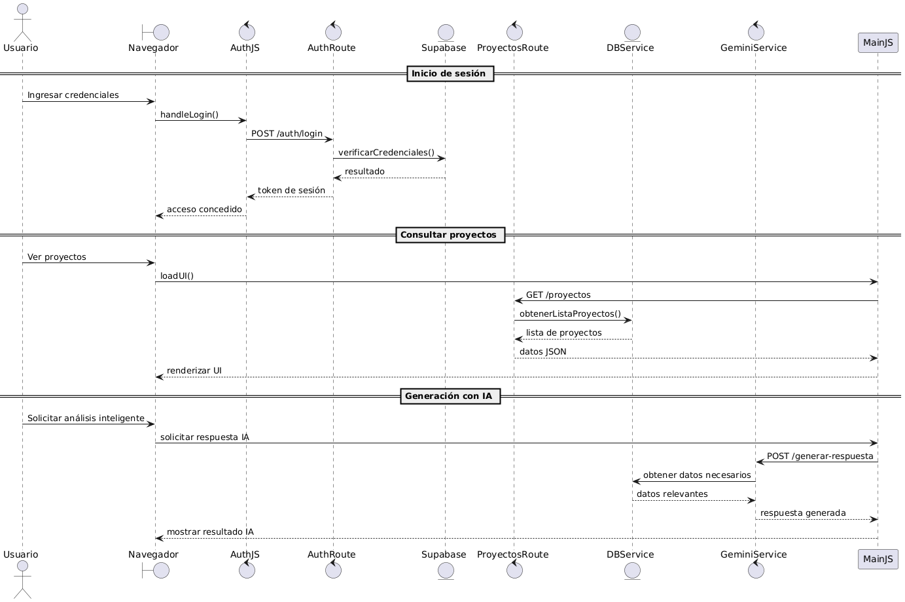
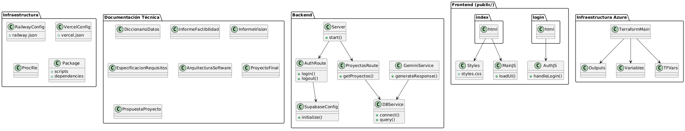

# UNIVERSIDAD PRIVADA DE TACNA

**FACULTAD DE INGENIERÍA**  
**Escuela Profesional de Ingeniería de Sistemas**

**Proyecto**  
**“Generador de documentación impulsado por IA (GDI-IA)”**

**Curso:**  
*Calidad y Pruebas de Software*

**Docente:**  
*Mag. Patrick Cuadros Quiroga*

**Integrantes:**
- Ancco Suaña, Bruno Enrique (2023077472)
- Akhtar Oviedo, Ahmed Hasan (2022074261)
- Ayala Ramos, Carlos Daniel (2022074266)
- Salas Jiménez, Walter Emmanuel (2022073896)

**Tacna – Perú**  
**2025**

 

---

|**Versión**|**Hecha por**|**Revisada por**|**Aprobada por**|**Fecha**|**Motivo**|
|:--:|:--|:--|:--|:--|:--|
|1.0|AHAO, CDAR, WESJ, BEAS|PCQ|-|01/06/2025|Versión 1.0|
|2.0|AHAO, CDAR, WESJ, BEAS|PCQ|-|01/06/2025|Versión 2.0|

## Índice General

1. [Introducción](#introducción)
2. [Generalidades de la Empresa](#generalidades-de-la-empresa)
3. [Visionamiento de la Empresa](#visionamiento-de-la-empresa)
4. [Análisis de Procesos](#análisis-de-procesos)
5. [Especificación de Requerimientos de Software](#especificación-de-requerimientos-de-software)
6. [Fase de Desarrollo](#fase-de-desarrollo)
7. [Conclusiones](#conclusiones)
8. [Recomendaciones](#recomendaciones)

---

## Introducción

El presente documento de Especificación de Requerimientos de Software (ERS) describe de manera detallada las funcionalidades, restricciones y características necesarias para el desarrollo del proyecto **Generador de Documentación Impulsado por IA (GDI-IA)**, propuesto para DevStar Solutions.  
El objetivo principal es diseñar e implementar una plataforma web inteligente que asista en la generación automatizada de documentos formales, utilizando tecnologías de inteligencia artificial especializadas en redacción, análisis de contenido y formateo estructurado.

---

## Generalidades de la Empresa

### 1. Nombre de la Empresa
**DevStar Solutions**

### 2. Visión
Ser reconocidos como la empresa líder (Top 1) en la creación de soluciones de software innovadoras y de alta calidad a nivel nacional e internacional.

### 3. Misión
Ofrecer productos y servicios de software que integren tecnologías emergentes, como la inteligencia artificial, para resolver de manera eficiente las necesidades de nuestros clientes, mejorando su productividad y competitividad en el mercado.

### 4. Organigrama

## Visionamiento de la Empresa

### 1. Descripción del Problema
Actualmente, muchas organizaciones y profesionales pierden tiempo valioso en la elaboración manual de documentos formales. Esta falta de automatización genera costos innecesarios, retrasa la entrega de proyectos y afecta la eficiencia operativa. DevStar Solutions identificó la necesidad de una plataforma que permita automatizar la generación de documentos estructurados utilizando IA, optimizando tiempos y asegurando calidad.

### 2. Objetivos de Negocios
- Incrementar el portafolio de soluciones innovadoras de DevStar Solutions.
- Mejorar la eficiencia interna y de los clientes mediante automatización documental.
- Posicionar a la empresa como referente en IA aplicada a la productividad empresarial.
- Generar nuevas fuentes de ingresos con un modelo SaaS escalable.

### 3. Objetivos de Diseño
- Desarrollar una plataforma web intuitiva, segura y accesible.
- Integrar motores de IA para la generación eficiente de contenido.
- Garantizar alta disponibilidad, confiabilidad y rendimiento.
- Permitir personalización de formatos documentales.

### 4. Alcance del proyecto
El proyecto contempla el desarrollo de una plataforma web que permita:
- Capturar información guiada de usuarios.
- Procesar dicha información usando IA.
- Generar documentos en PDF y DOCX.
- Gestionar el historial de documentos creados.
- Brindar acceso por suscripción a funcionalidades premium.

### 5. Viabilidad del Sistema
El análisis realizado (técnico, operativo, legal y financiero) demuestra que el proyecto es viable:
- Infraestructura tecnológica adecuada.
- Personal calificado.
- Tendencia favorable del mercado.
- VAN positivo y relación B/C favorable.

### 6. Información obtenida del Levantamiento de Información
- Alta demanda de automatización documental en sectores académicos y tecnológicos.
- Interés de usuarios potenciales en soluciones accesibles y fáciles de usar.
- Necesidad de reducir tiempos de entrega de documentos formales.
- Limitada oferta de plataformas con integración modular de IA.

## Análisis de Procesos

### a) Diagrama de actividades

## Especificación de Requerimientos de Software

### a) Cuadro de Requerimientos funcionales Inicial
| REQ | Requerimiento                                                                                     |
|-----|---------------------------------------------------------------------------------------------------|
| RF1 | El sistema web debe permitir la creación de cuentas a usuarios nuevos.                            |
| RF2 | El sistema web debe tener un módulo para introducir información clave según el formato escogido.  |
| RF3 | El sistema debe permitir la selección de formato estandarizado para iniciar un nuevo documento.   |
| RF4 | El sistema debe contener modelos de IA.                                                           |
| RF5 | Permitir generación de documentos completos en Word (versión 2).                                  |
| RF6 | Permitir generación de documentos en PDF según formatos establecidos.                             |
| RF7 | Permitir descarga inmediata del documento generado.                                               |
| RF8 | Generar citas y bibliografía automáticamente según el formato.                                    |
| RF9 | Almacenar historial de documentos realizados.                                                     |
| RF10| Permitir edición de documentos previamente creados (versión 2).                                   |
| RF11| Permitir generación en varios idiomas si lo soporta el modelo IA.                                 |
| RF12| Permitir creación de cuentas para administradores.                                               |

### b) Cuadro de Requerimientos No funcionales

| REQS | Requerimiento                            | Descripción                                                                                | Prioridad | Estado   |
|------|------------------------------------------|--------------------------------------------------------------------------------------------|-----------|----------|
| RNF1 | Integrar Login                           | Validación de credenciales                                                                 | Alta      | Terminado|
| RNF2 | Accesibilidad multiplataforma            | Accesible desde navegadores modernos y dispositivos móviles                                | Alta      | En Proceso|
| RNF3 | Seguridad de la información              | Autenticación, cifrado y control de acceso                                                 | Alta      | En Proceso|
| RNF4 | Escalabilidad                            | Preparado para crecer en usuarios y tipos de formatos                                      | Alta      | En Proceso|
| RNF5 | Compatibilidad con estándares documentales| Cumplir con formatos institucionales                                                       | Alta      | En Proceso|
| RNF6 | Tolerancia a fallos                      | Mensaje claro y reintento ante fallo                                                       | Alta      | En Proceso|
| RNF7 | Registro de errores (log)                | Registrar errores internos para soporte y mejora                                           | Alta      | En Proceso|
| RNF8 | Interfaz adaptativa (responsive)          | Adaptarse a diferentes tamaños de pantalla                                                 | Alta      | En Proceso|

### c) Cuadro de Requerimientos funcionales Final

| Código | Requerimiento             | Descripción                                                                                          | Prioridad | Estado     |
|--------|--------------------------|------------------------------------------------------------------------------------------------------|-----------|------------|
| RF001  | RegistroUsuario          | Permitir la creación de cuentas de usuarios nuevos                                                   | Alta      | Terminado  |
| RF002  | RegistroAdmin            | Permitir la creación de cuentas de administrador                                                     | Alta      | Terminado  |
| RF003  | ModuloInput              | Módulo para ingresar información clave según formato                                                 | Alta      | En Proceso |
| RF004  | SeleccionFormato         | Permitir seleccionar formato estandarizado para documentos                                           | Alta      | En Proceso |
| RF005  | MultiIdioma              | Permitir generación de documentos en distintos idiomas                                               | Alta      | En Proceso |
| RF006  | ModelosIA                | Contener modelos de IA                                                                               | Alta      | En Proceso |
| RF007  | GenerarPDF               | Permitir generación de documentos completos en PDF                                                   | Alta      | En Proceso |
| RF008  | DescargaInmediata        | Permitir descarga inmediata del documento generado                                                   | Alta      | En Proceso |
| RF009  | GenerarCitas             | Generar citas y bibliografía automáticamente                                                         | Alta      | En Proceso |
| RF010  | HistorialDocs            | Almacenar historial de documentos realizados                                                         | Alta      | En Proceso |
| RF011  | DescargaHistorial        | Permitir descarga de documentos previos                                                              | Alta      | En Proceso |

### d) Reglas de Negocio

- **RN-01: Control de Acceso**  
  Solo usuarios autenticados pueden acceder a funcionalidades.  
  *Aplicación:* Todas las secciones.

- **RN-02: Plantillas y Formatos Estandarizados**  
  Los documentos deben seguir plantillas institucionales o seleccionadas por usuario.

- **RN-03: Idioma y Localización**  
  Documentos deben respetar el idioma seleccionado.

- **RN-04: Versionamiento de Documentos**  
  Cada documento generado se almacena como una nueva versión.

- **RN-05: Revisión de Calidad de Documentos**  
  Todo documento debe ser evaluado por el usuario mediante feedback.

- **RN-06: Roles y Permisos**  
  Administradores acceden a estadísticas de uso, feedback y ajustes de IA.

## Fase de Desarrollo

### A. Perfiles de Usuario

- **Usuario General:**  
  Utiliza la herramienta para generar documentación guiada o por IA.
- **Administrador:**  
  Supervisa el uso, evalúa feedback, ajusta configuraciones y actualiza plantillas o modelos IA.

### Historias de Usuario Principales

| HU   | Nombre                        | Descripción                                                                                      |
|------|-------------------------------|--------------------------------------------------------------------------------------------------|
| HU01 | Inicio de Sesión              | Acceder a la plataforma para generar documentación                                               |
| HU02 | Descripción del Proyecto      | Formularios para ingresar datos clave sobre el proyecto                                          |
| HU03 | Selección de Plantilla        | Elegir una plantilla de documentación                                                            |
| HU04 | Flujo de Preguntas Iniciales  | IA realiza preguntas para determinar tipo de documentación                                       |
| HU05 | Preguntas de la IA            | IA realiza preguntas específicas sobre el proyecto                                               |
| HU06 | Generación de Documento       | Generar documento base en Markdown o texto plano                                                 |
| HU07 | Generación de Diagramas       | Generar diagramas UML usando APIs externas (PlantUML, Mermaid)                                   |
| HU08 | Priorización de Diagramas     | Priorización de tipos de diagramas UML según contexto                                            |
| HU09 | Vista Previa de Documento     | Ver vista previa antes de descargar                                                              |
| HU10 | Descarga en Formato PDF       | Descargar documento generado en PDF                                                              |
| HU11 | Guardado de Documentación     | Guardar en servidor FTP                                                                          |
| HU12 | Entrenamiento de la IA        | Administrador revisa feedback para mejorar la IA                                                 |
| HU13 | Especificar Idioma            | Elegir idioma de la documentación                                                                |
| HU14 | Feedback del Usuario          | Proveer feedback sobre la calidad de la documentación                                            |
| HU15 | Ayuda y Soporte               | Acceso a ayuda y soporte                                                                         |

### B. Modelo Conceptual
#### Diagrama de Paquetes

#### Diagrama de Casos de Uso

## Modelo Lógico
#### Analisis de Objetos

#### Analisis de Actividades con Objetos

#### Analisis de Secuencia

#### Diagrama de Clases

## Conclusiones

El proyecto **GDI-IA** propone una solución innovadora para automatizar la creación de documentos técnicos y académicos, respondiendo a necesidades de eficiencia, estandarización y calidad.  
La especificación de requerimientos presentada define las funcionalidades esenciales, necesidades de usuarios y estándares de calidad para guiar el desarrollo y mantenimiento del sistema.  
Su correcta implementación garantizará valor organizacional, mayor productividad y reducción de errores.

## Recomendaciones

- Asegurar infraestructura robusta y segura para disponibilidad y rendimiento.
- Implementar procedimientos de actualización y verificación de APIs de IA.
- Refuerzo de medidas de seguridad para la protección de datos y acceso por roles.
- Planificar escalabilidad del sistema desde versiones iniciales.