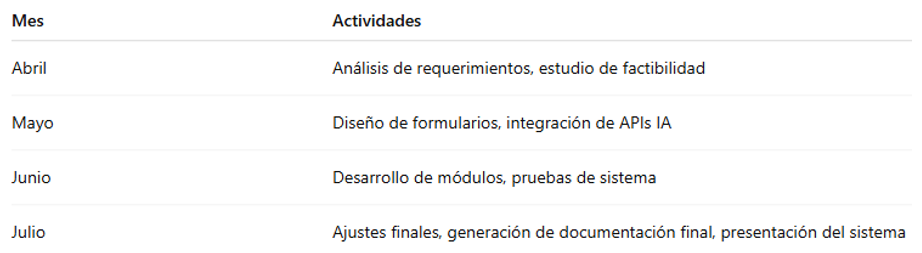
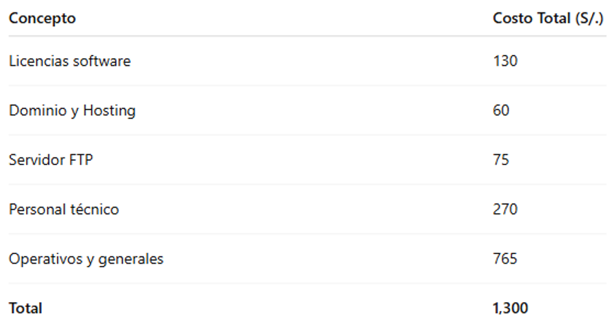

# UNIVERSIDAD PRIVADA DE TACNA

## FACULTAD DE INGENIERÍA

### Escuela Profesional de Ingeniería de Sistemas

## Proyecto

**“Generador de documentación impulsado por IA (GDI-IA)”**

**Informe Proyecto Final**

**Curso:**  
*Calidad y Pruebas de Software*

**Docente:**  
*Mag. Patrick Cuadros Quiroga*

**Integrantes:**
- *Ancco Suaña, Bruno Enrique (2023077472)*
- *Akhtar Oviedo, Ahmed Hasan (2022074261)*
- *Ayala Ramos, Carlos Daniel (2022074266)*
- *Salas Jiménez, Walter Emmanuel (2022073896)*

**Tacna – Perú**  
**2025**

 

---

| **Versión** | **Hecha por**         | **Revisada por** | **Aprobada por** | **Fecha**   | **Motivo**      |
|:-----------:|:---------------------:|:----------------:|:----------------:|:-----------:|:---------------:|
| 1.0         | AHAO,CDAR,WESJ,BEAS                  | PCQ             |            | 2/06/2025  | Versión Original|

## Índice General

1. [Antecedentes](#antecedentes)
2. [Planteamiento del Problema](#planteamiento-del-problema)
3. [Objetivos](#objetivos)
4. [Marco Teórico](#marco-teórico)
5. [Desarrollo de la Solución](#desarrollo-de-la-solución)
6. [Cronograma](#cronograma)
7. [Presupuesto](#presupuesto)
8. [Conclusiones](#conclusiones)
9. [Recomendaciones](#recomendaciones)
10. [Bibliografía](#bibliografía)
11. [Anexos](#anexos)

---

## 1. Antecedentes

En **DevStar Solutions**, los procesos de documentación técnica eran lentos, inconsistentes y propensos a errores humanos. Se detectó la necesidad de una herramienta automatizada que, utilizando inteligencia artificial, permitiera generar documentación técnica coherente y estructurada.  
Esto dio origen al proyecto **GDI-IA**, cuyo propósito es brindar una solución modular y escalable para apoyar a desarrolladores, estudiantes y profesionales en la redacción de documentación formal:contentReference[oaicite:0]{index=0}.

## 2. Planteamiento del Problema

### Problema

La elaboración manual de documentos formales consume mucho tiempo y es propensa a errores de redacción, formato y consistencia, lo cual afecta la productividad y calidad del trabajo final.

### Justificación

Automatizar este proceso usando IA representa una solución eficiente para minimizar errores y reducir el tiempo invertido en la documentación técnica, mejorando así la productividad y organización interna.

### Alcance

- Generación de documentos para formatos FD01–FD06.
- Exportación en PDF y DOCX.
- Generación automática de bibliografía y diagramas UML.
- Plataforma accesible vía navegador web.
- *No incluye edición manual de documentos dentro del sistema*.

## 3. Objetivos

### Objetivo General

Desarrollar una plataforma web impulsada por inteligencia artificial que permita la generación automatizada de documentos técnicos, adaptados a plantillas estándar.

### Objetivos Específicos

- Diseñar formularios interactivos para entrada de datos.
- Integrar múltiples modelos IA.
- Permitir exportación multiformato (PDF/DOCX).
- Implementar módulos de almacenamiento y control de versiones.
- Integrar APIs para generación de diagramas UML.

## 4. Marco Teórico

Se revisaron conceptos clave sobre inteligencia artificial aplicada a la redacción automática, integración de APIs como **OpenAI** y **PlantUML**, y tecnologías como PHP, MySQL, HTML, CSS, JavaScript, TCPDF, entre otros.  
Asimismo, se consideraron metodologías ágiles para el desarrollo del software y estándares de documentación institucional.

## 5. Desarrollo de la Solución

### Análisis de Factibilidad

- **Técnica:** Tecnologías maduras y personal calificado.
- **Económica:** Inversión de S/. 1,300 con VAN = S/. 16,568.85, TIR positiva y B/C = 13.81
- **Operativa:** Personal capacitado, interfaz amigable, bajo mantenimiento.
- **Legal:** Cumple con la normativa de protección de datos (GDPR).
- **Social:** Fomenta buenas prácticas organizacionales.
- **Ambiental:** Reducción del uso de papel mediante digitalización.

### Tecnología de Desarrollo

- **Backend:** PHP
- **Frontend:** HTML, CSS, JS
- **Base de datos:** MySQL
- **IA:** OpenAI, Hugging Face
- **Generación de diagramas:** PlantUML / Mermaid
- **Generación de documentos:** TCPDF, DomPDF

### Metodología de Implementación

Se siguió una metodología incremental con las siguientes fases:
- Análisis de requerimientos (FD03)
- Diseño de la arquitectura (FD04)
- Desarrollo de módulos (formularios, generación IA, exportación)
- Pruebas de funcionalidad, carga y seguridad
- Implementación y almacenamiento

## 6. Cronograma

## 7. Presupuesto

## 8. Conclusiones

El proyecto **GDI-IA** ha demostrado ser viable técnica, económica y operativamente. Ha logrado automatizar con éxito la creación de documentación técnica bajo distintos formatos, optimizando tiempo y mejorando la calidad del contenido.  
La arquitectura modular y la integración con IA le otorgan un gran potencial de escalabilidad y adaptabilidad futura.

## 9. Recomendaciones

- Realizar mantenimiento periódico de las APIs integradas.
- Fortalecer medidas de seguridad y cifrado de datos.
- Considerar nuevas funcionalidades como edición visual.
- Escalar la infraestructura en caso de aumento de usuarios.
- Mantener retroalimentación continua con los usuarios.

## 11. Anexos

- **Anexo 01:** Informe de Factibilidad (FD01)
- **Anexo 02:** Documento de Visión
- **Anexo 03:** Documento SRS
- **Anexo 04:** Documento SAD